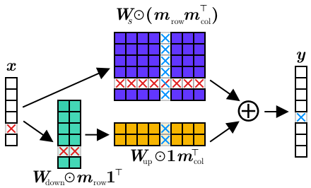
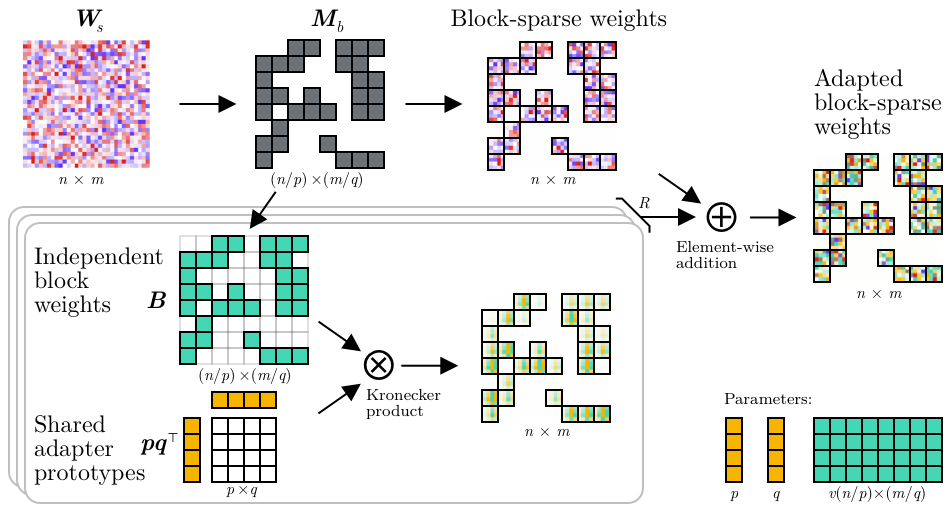

# Structured Pruning Adapters for PyTorch

<div align="left">
  <a href="https://pypi.org/project/structured-pruning-adapters/">
    
  </a>
  <a href="https://badge.fury.io/py/structured-pruning-adapters">
    
  </a>
  <!-- <a href="https://structured-pruning-adapters.readthedocs.io/en/latest/?badge=latest">
    
  </a> -->
  <!-- <a href="https://pepy.tech/project/structured-pruning-adapters">
    
  </a> -->
  <a href="https://opensource.org/licenses/Apache-2.0">
    
  </a>
  <a href="https://arxiv.org/abs/2211.10155">
    
  </a>
  <a href="https://github.com/psf/black">
    
  </a>
    <a href="https://codecov.io/github/LukasHedegaard/structured-pruning-adapters" > 
     
  </a>
  <a href="https://www.codefactor.io/repository/github/lukashedegaard/structured-pruning-adapters">
    
  </a>
</div>

```bash
pip install structured-pruning-adapters
```
## A happy mariage 👰‍♀️🤵‍♂️

__Pruning__ is an effective method for reducing the size of neural networks. Besides reducing the parameter count, the process _can_ accelerate inference as well. 
CPUs can handle sparse weights just fine, but GPUs need structured weights for an acceleration to happen. 
A structured approach to pruning i.e., removing network channels [[paper](https://www.sciencedirect.com/science/article/pii/S0031320321000868)] or blocks of weights [[paper](https://aclanthology.org/2021.emnlp-main.829.pdf)], generally yields speedups as well

\+

__Adapters__ [[paper](https://proceedings.neurips.cc/paper/2017/file/e7b24b112a44fdd9ee93bdf998c6ca0e-paper.pdf)] have emerged as an alternative to fine-tuning, in which the prior network weights are unaltered, and a new set of _adapters_ weights are added to the network to learn a specific task.
Some types of adapters add new layers, others are _fusible_ with existing weights and don't have a run-time overhead.
When a single base-model is deployed with many specialised models, these structures can save a lot of parameters compared with full fine-tuning.

=
<!-- | |
| --- | -->
[__Structured Pruning Adapters__](https://github.com/LukasHedegaard/structured-pruning-adapters) are the offspring of Structured Pruning and Fusible Adapters, and can be used for _Transfer Learning_ which has:
- ✅ Extremely few learned parameters (binary pruning mask + masked adapter weights) 👌
- ✅ Accelerated network inference 🏎💨


## How to use this library
Use in conjunction with any Structured Pruning technique. 
1. Install the library:
    ```bash
    pip install structured-pruning-adapters
    ```
2. Replace Linear and Conv layers with an SP Adapter:
    ```python3
    from torch.nn import Linear
    from sp_adapter import SPLoRA

    reg_lin = Linear(256, 512, bias=True)
    spa_lin = SPLoRA(reg_lin, rank=32)

    # Or replace all applicable layers in a network
    spa_net = SPLoRA(reg_net, rank=32)
    ```
3. Employ any Structured Pruning method. We conducted extensive experimens with multiple [channel-pruning](https://github.com/lukashedegaard/channel-spa-experiments) and [block-pruning](https://github.com/lukashedegaard/block-spa-experiments) methods.

4. Get pruned SP Adapter weights:
    ```python3
    # Specify mask
    spa_lin.configure_parameter_read(
        adapter_weights_only=True,
        in_features_mask=torch.tensor([1, 0, ..., 1], dtype=torch.bool)
        out_features_mask=torch.tensor([0, 1, ..., 1], dtype=torch.bool),
    )   # 👆 masks are learned via your choice of Structured Pruning method

    # Read parameters as usual
    spa_lin.parameters()
    spa_lin.named_parameters()
    spa_lin.state_dict()
    ```

### Demo
See also [notebooks/demo.ipynb](notebooks/demo.ipynb) for a hands-on demo.

### Structured Pruning Low-Rank Adapter (SPLoRA) for _Channel Pruning_ 
```python3
from sp_adapters import SPLoRA
```
<div align="center">

</div>
Adds a low-rank bottle-neck projection in projection in parallel with the main weights projection.

<br/>

### Structured Pruning Low-rank PHM Adapter (SPLoPA) for _Block Pruning_ (experimental)
```python3
from sp_adapters import SPLoPA
```

<div align="center">

</div>

Uses a variation on the Parameterized Hypercomplex Multiplication (PHM) layer [[paper](https://openreview.net/forum?id=rcQdycl0zyk)] with shared low-rank prototypes for block-sparse adaptation.

## Citation
If you enjoy this work, please consider citing it
```bibtex
@article{hedegaard2022structured,
  title={Structured Pruning Adapters},
  author={Lukas Hedegaard and Aman Alok and Juby Jose and Alexandros Iosifidis},
  journal={preprint, arXiv:2211.10155},
  year={2022}
}
```

## Acknowledgement
This work was done in conjunction with a research exchange at [Cactus Communications 🌵](https://cactusglobal.com).

This work has received funding from the European Union’s Horizon 2020 research and innovation programme under grant agreement No 871449 [(OpenDR) 🇪🇺](https://opendr.eu).

